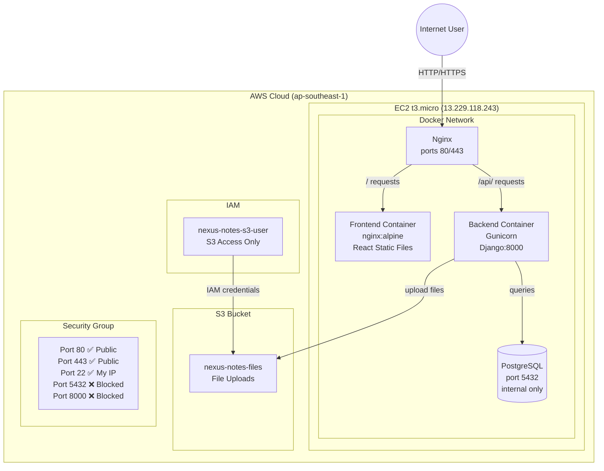

# ☁️ Nexus Notes - Cloud Engineering Technical Assessment


A production-ready, full-stack note-taking application deployed on AWS EC2 using Docker, demonstrating best practices in cloud infrastructure, containerization, and backend/frontend integration.

## Project Stack
- **Backend**: Django 6.0.3 + Django REST Framework
- **Frontend**: React 19 + TypeScript + Vite + shadcn/ui
- **Database**: PostgreSQL 16
- **Containerization**: Docker + Docker Compose
- **Reverse Proxy**: Nginx
- **Cloud**: AWS (EC2 + S3 + IAM)
- **SSL**: Self-signed certificate (documented)

## Infrastructure Details
- **EC2 instance**: t3.micro, Ubuntu 24.04, ap-southeast-1 (Singapore)
- **Public IP**: `13.229.118.243`
- **S3 bucket**: `nexus-notes-files`, ap-southeast-1
- **IAM user**: `nexus-notes-s3-user` with `AmazonS3FullAccess` policy
- **Security group**: ports `80`, `443` public | port `22` SSH only | port `5432` NOT exposed

## Docker Setup
- **4 containers**: `postgres`, `backend`, `frontend`, `nginx`
- `postgres`: NOT exposed to host (internal only)
- `backend`: gunicorn on port `8000` (internal only)
- `frontend`: nginx serving React build (internal only)
- `nginx`: ports `80` and `443` exposed to public
- All secrets via `.env` file, never hardcoded

## Folder Structure on EC2
```text
/home/ubuntu/app/
├── nexus-notes-backend/
├── nexus-notes-client/
├── nginx/
│   ├── nginx.conf
│   └── certs/
│       ├── cert.pem
│       └── key.pem
├── docker-compose.yml
└── .env
```

## Infrastructure Diagram



## 1. Architecture Design

The Nexus Notes system utilizes a modern containerized architecture deployed on a single AWS EC2 instance, designed for simplicity, ease of deployment, and demonstration of full-stack integration.

### Traffic Flow:
`User (Browser)` ➡️ `Nginx (Reverse Proxy Port 80/443)`
  ➡️ `Frontend Container (Internal Nginx serving static React files)`
  ➡️ `Backend Container (Gunicorn/Django API on internal port 8000)`
    ➡️ `PostgreSQL Container (Database on internal port 5432)`
    ➡️ `AWS S3 (File Storage via boto3)`

### Technology Choices:
- **Django + DRF**: Rapid API development with built-in admin, ORM, and strong security defaults.
- **React + Vite + shadcn/ui**: Fast, modern frontend development with a beautiful, accessible component library.
- **PostgreSQL**: Robust, ACID-compliant relational database.
- **Docker + Compose**: Ensures environment parity between development and production, simplifying deployment.
- **Nginx**: High-performance reverse proxy for serving static assets, routing API requests, and terminating SSL.
- **AWS EC2**: Cost-effective, scalable compute for running the Docker host.
- **AWS S3**: Highly durable, scalable object storage for user-uploaded notes and files, offloading storage overhead from the EC2 instance.

### Architecture Overview
```text
                          +-------------------------+
                          |      Browser/Client     |
                          +------------+------------+
                                       | HTTPS (443) / HTTP (80)
+--------------------------------------v--------------------------------------+
| AWS EC2 Instance (t3.micro)                                                 |
|                                                                             |
|  +-----------------------------------------------------------------------+  |
|  | Nginx Container (Reverse Proxy / SSL Termination)                     |  |
|  +--------+------------------------------------------+-------------------+  |
|           | /api/*                                   | /                    |
|  +--------v----------------------+       +-----------v-------------------+  |
|  | Backend Container (8000)      |       | Frontend Container            |  |
|  | Django + Gunicorn             +------>+ Nginx (Static Files)          |  |
|  +--------+------------------+---+       +-------------------------------+  |
|           |                  |                                              |
|  +--------v---------------+  |                                              |
|  | Postgres Container     |  | (Boto3 API)                                  |
|  | PostgreSQL (5432)      |  |                                              |
|  +------------------------+  |                                              |
+------------------------------|----------------------------------------------+
                               |
                       +-------v------+
                       | AWS S3       |
                       | bucket       |
                       +--------------+
```

## 2. Deployment Steps

Follow these steps to deploy the application on a fresh Ubuntu EC2 instance.

### Prerequisites (On EC2)
Install required tools: git, docker, compose, and openssl.
```bash
sudo apt update && sudo apt upgrade -y
sudo apt install -y git docker.io docker-compose-v2 openssl
sudo usermod -aG docker ubuntu
```
*Note: Log out and back in to apply docker group changes.*

### Step-by-Step Setup
1. **Create App Directory:**
   ```bash
   mkdir -p /home/ubuntu/app && cd /home/ubuntu/app
   ```

2. **Clone Repositories:**
   ```bash
   git clone <backend-repo-url> nexus-notes-backend
   git clone <frontend-repo-url> nexus-notes-client
   ```

3. **Generate SSL Certificates (Self-Signed for Demo):**
   ```bash
   mkdir -p nginx/certs
   openssl req -x509 -nodes -days 365 -newkey rsa:2048 \
     -keyout nginx/certs/key.pem \
     -out nginx/certs/cert.pem \
     -subj "/C=US/ST=State/L=City/O=Organization/CN=13.229.118.243"
   ```

4. **Configure Environment Variables:**
   Create a `.env` file in `/home/ubuntu/app/`:
   ```bash
   nano .env
   ```
   *Add the following configurations:*
   ```env
   # Database
   POSTGRES_DB=nexusnotes
   POSTGRES_USER=postgres
   POSTGRES_PASSWORD=your_secure_password
   
   # Django
   DJANGO_SECRET_KEY=your_django_secret_key
   DJANGO_DEBUG=False
   DJANGO_ALLOWED_HOSTS=13.229.118.243,localhost,127.0.0.1
   
   # AWS S3
   AWS_ACCESS_KEY_ID=your_access_key
   AWS_SECRET_ACCESS_KEY=your_secret_key
   AWS_STORAGE_BUCKET_NAME=nexus-notes-files
   AWS_S3_REGION_NAME=ap-southeast-1
   
   # Frontend
   VITE_API_URL=https://13.229.118.243/api
   ```

5. **Deploy with Docker Compose:**
   Ensure `docker-compose.yml` is in the root `app` directory, pulling from the cloned folders.
   ```bash
   docker compose up --build -d
   ```

6. **Verify Deployment:**
   ```bash
   docker compose ps
   docker compose logs -f nginx
   ```
   Visit `https://13.229.118.243` in your browser.

## 3. IAM Configuration

To allow the Django backend to upload files to S3, an IAM User (`nexus-notes-s3-user`) was created.

- **Current Policy (Demo)**: `AmazonS3FullAccess`
  - *Why used for demo?* Ensures immediate functionality and ease of testing without hitting granular permission errors during the assessment verification.

- **Least Privilege Principle (Production Recommendation)**:
  In a real production environment, granting full access is a severe security risk. The IAM user should only have the exact permissions necessary to perform its required functions (upload, read, delete notes on a *specific* bucket).

### Restrictive Production Policy Example:
```json
{
    "Version": "2012-10-17",
    "Statement": [
        {
            "Sid": "VisualEditor0",
            "Effect": "Allow",
            "Action": [
                "s3:PutObject",
                "s3:GetObject",
                "s3:DeleteObject"
            ],
            "Resource": "arn:aws:s3:::nexus-notes-files/*"
        },
        {
            "Sid": "VisualEditor1",
            "Effect": "Allow",
            "Action": [
                "s3:ListBucket"
            ],
            "Resource": "arn:aws:s3:::nexus-notes-files"
        }
    ]
}
```

## 4. Security Group Rules

The EC2 instance uses a strictly minimized Security Group to control inbound traffic.

| Port | Protocol | Source | Purpose |
| :--- | :--- | :--- | :--- |
| `22` | TCP | `My IP` / `Admin IP` | SSH Access for administration. |
| `80` | TCP | `0.0.0.0/0` | HTTP traffic (automatically redirected to HTTPS by Nginx). |
| `443` | TCP | `0.0.0.0/0` | HTTPS traffic for secure web access. |

### Security Design Choices:
- **Port 5432 (PostgreSQL) is CLOSED**: The database should never be exposed to the public internet. The Django backend connects to the database via internal Docker networking.
- **Port 8000 (Gunicorn) is CLOSED**: Direct communication with the backend application server is prohibited. All traffic must pass through the Nginx reverse proxy.
- **SSH (Port 22)**: Restricted to a specific IP address rather than `0.0.0.0/0` to prevent brute-force attacks.

## 5. AWS Free Tier Setup

This infrastructure is designed to operate within the AWS Free Tier limitations to minimize costs.

- **Compute**: `t3.micro` instance provides 750 hours/month (enough to run 24/7).
- **Storage**: S3 provides 5GB of standard storage, 20,000 GET requests, and 2,000 PUT requests per month.
- **Database**: Using containerized PostgreSQL on the EC2 instance avoids RDS costs.

### Best Practices to Maintain Free Tier:
- Set up **AWS Budgets** to receive an alert if costs exceed $0.01.
- Monitor EC2 CPU Credit Balances; `t3.micro` uses burstable performance.
- Regularly clear old/unnecessary files from S3 if approaching the 5GB limit.

## 6. Scaling (Future Enhancements)

While the current single-node Docker setup is perfect for this assessment, a highly available, production-scale environment would evolve into:

1. **Load Balancing**: Place an Application Load Balancer (ALB) in front of multiple EC2 instances.
2. **Horizontal Scaling**: Utilize EC2 Auto Scaling Groups to dynamically add or remove backend instances based on CPU utilization.
3. **Managed Database**: Migrate from containerized PostgreSQL to Amazon RDS for PostgreSQL to benefit from automated backups, Multi-AZ deployments, and easier scaling.
4. **CDN**: Implement Amazon CloudFront in front of S3 and the frontend Nginx reverse proxy to drastically improve static asset delivery speeds globally.
5. **Caching**: Introduce Amazon ElastiCache (Redis) to cache frequently accessed notes and reduce database load.

## 7. Backup Strategy

Data integrity is critical. Our current and future backup strategies include:

### Current Setup (Docker/EC2):
- **Database**: Periodic `pg_dump` of the PostgreSQL container volume.
  ```bash
  docker exec -t postgres pg_dumpall -c -U postgres > dump_`date +%d-%m-%Y"_"%H_%M_%S`.sql
  ```
- **File Storage**: AWS S3 inherently provides high durability, but S3 Versioning should be enabled.
- **Instance**: Periodic AWS EBS Snapshots of the root volume to instantly restore the OS and configuration state.

### Production Setup (Post-Migration):
- **Amazon RDS**: Automated daily backups with a specified retention period (e.g., 7 days) and point-in-time recovery.

## 8. SSL Documentation

SSL is crucial for protecting sensitive user data (like passwords and personal notes) in transit.

- **Current Demo Setup**: A self-signed certificate was generated via OpenSSL to demonstrate HTTPS configuration. Browsers will show a warning as the certificate authority is unknown, but traffic remains encrypted.

- **Production Setup**: We would use **Let's Encrypt** with Certbot for free, automated, and trusted certificates once a real domain name is attached to the EC2 elastic IP.

### Certbot Implementation (Production):
Replace `<your-domain.com>` with the actual domain.
```bash
# Install Certbot
sudo apt install -y certbot python3-certbot-nginx

# Obtain and install the trusted certificate
sudo certbot --nginx -d <your-domain.com> -d www.<your-domain.com>

# Test automatic renewal
sudo certbot renew --dry-run
```
Nginx configuration (`nginx.conf`) would be updated automatically by Certbot to point to `/etc/letsencrypt/live/...` instead of the local `./certs` folder used in docker-compose.